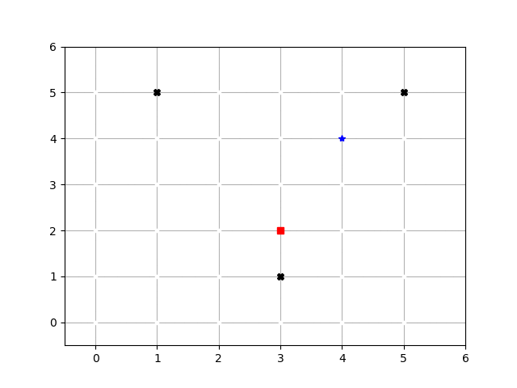

# RE-learn to be an Engineer
Asciidoctor version: {asciidoctor-version}
:toc:
:toc: preamble
:toc-title: Learning days of an Engineer 
:toclevels: 4
:sectnums:

//Configuration stuff
:source-highlighter: coderay
:coderay-linenums-mode: inline

I'm aiming with this journal not only to improve my knowledge about data structures and algorithm using python but also to better translate mathematical models like econometrics, and robotics. I'm gonna expend at least 4 hours 5 days per week between reading, coding and updating this journal

Disclaimer : You might find stuff in Spanish and German. 

## Day 1 21-02-2025

I start with this book **grooking 
Artificial Intelligence Algorithms by Rishal Hurbans** with focus on algorithms

### What I read

#### Chapter 2 search Fundamentals

_Refreshing Big O Notation_ author implies:

* O(n!)
* O(2^n)
* O(n²)
* O(n log n)
* O(n)
* O(log n)
* O(1) 

Data structure:

* Array -> Research required 
* Stack -> Research required
* Queue -> Research required
* Linked List -> Research required
* Graph -> Planing and searching
* Tree -> Planing and searching

##### Graphs 
    have _edge_(E), _Node_ (N) / _Vertex_ (V)

Edge(E) connect nodes (N) / Vertex -> easy 

-> TODO: add graph
[%linenums,Python]
----
# Array of arrays
[ 
    [a,f],
    [a,c],
    [f,b],
    [c,d],
    [b,g],
    [g,d],
    [d,e],
    [e,h]
]
----
Adjacency Matrix are also a good way to represent it

##### Tree

Like in consulting tree represents a hierarchy of values / objects. 
**char of Trees:**

* Root node
* Edges
* Children
* Leaf nodes
* depth
* height
* degree -> #children a node has 

A Tree have a root node which can have children. iF children have children -> Parent node else leaf nodes

* Depth-first search (DFS): explores a specific path from start until it finds a goal at the utmost depth

* Breadth-first search (BFS): explores all options at specific depth before moving to options deeper in the tree
** BFS works great with FIFO because we need a queue to keep track of the nodes that we have to visit and from the nodes that we already visited.
** Depth levels needs to be tracked

EG:
[%linenums,Python]
----
# Example of a tree with height 5
[ Sequence
    [A]
    [BED]
    B[CL];E[FN];D[IO]
    C[DM];F[G];I[J];O[P]
    G[H];J[KQ]
]

----

The entire point of search algorithms is to search or generate these trees iteratively. Generating trees upfront is inefficient -> computationally expensive

### My Thoughts about it

Data and Information aren't the same while data means "raw facts", information requires context and therefore meaning

I'm not done with the chapter. I need to implement both algos

BFS can be used to find the shortest path to a point. Supply chain there are already some equations for it.
In robotics I could see it as part of path optimization

Tomorrow I will implement my first implementation based on pseudocode and create the first test for it 

---

## Day 2 24-02-2025

### What I did

today I expend around 2 hours working with the algorithm and a first implementation for a grid 

### My Thoughts about it

I underestimate the code for grid + algorithm and also trying to make it interactive. All at the same time was not the best idea (too many modifications at the same time).To avoid this tomorrow, I'll first define a few requirements for the grid (maze creator) and then design a simple architecture to code it faster.

## Day 3 26-02-2025

### What I did

today I expend around 3 hours working fixing the grid and creating the first Idea on how to implement the movement in the grid. The black x's are obstacles, the red square represents the goal and the blue star the starting point

### My Thoughts about it

It was nice to revisit concepts about unpacking and how to implement everything a little bit nicer. I could use OOP for the maze and add some methods like update maze, create maze and so on. But until might be too much for only two functions.

I've been also reading other books regarding algorithms and principle of data science. There is a lot to do and to improve. But after the maze generator I'll be developing the algos and making some benchmarking. 

*I don't want and will not use any LLM at the moment to generate my code* Pen and paper is the way to go right now to design and to write my pseudo code

## Day 3 27-02-2025

### What I did

Now the algorithm is implemented and with plot maze I can do some tests for it.

### My Thoughts about it

For a small 6x6 grid with 3 roadblocks the algo required 11 attempts to achieve the goal. For bigger mazes can be very slow. There are a few things that I can optimize in my code. Like the movement or the plotting tool of the maze. Also I shall remove the plot tool from the algo 